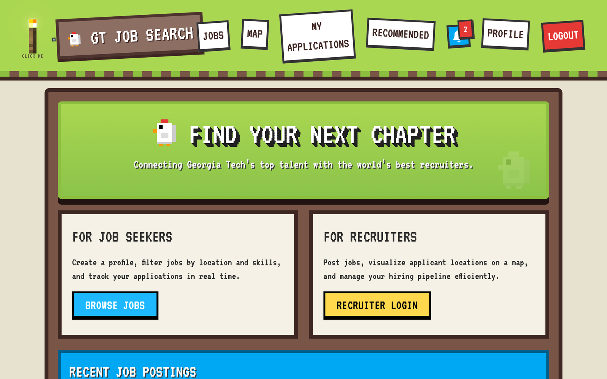
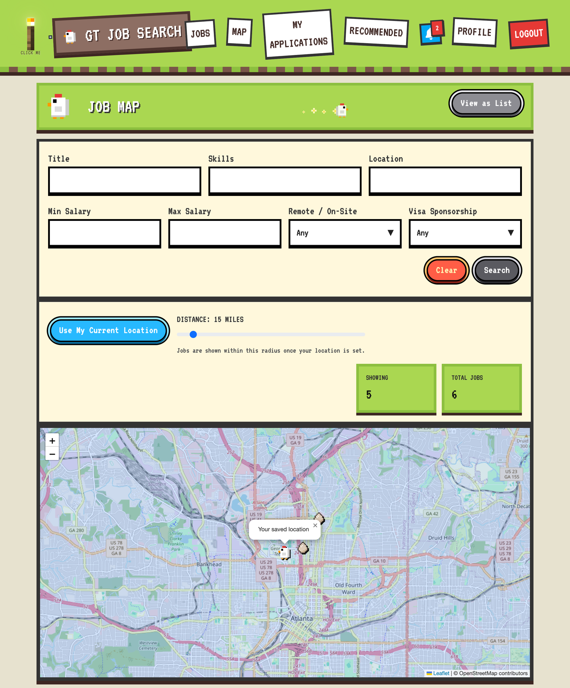
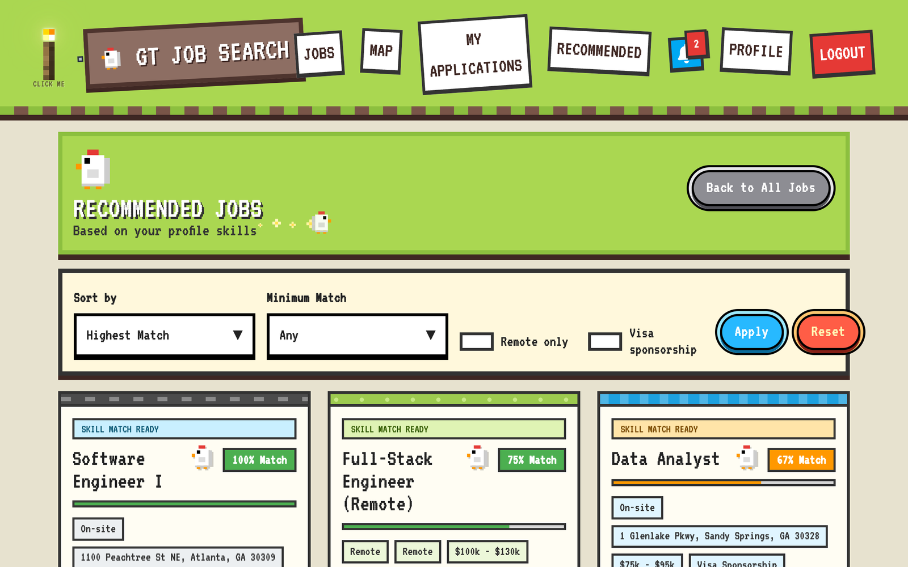
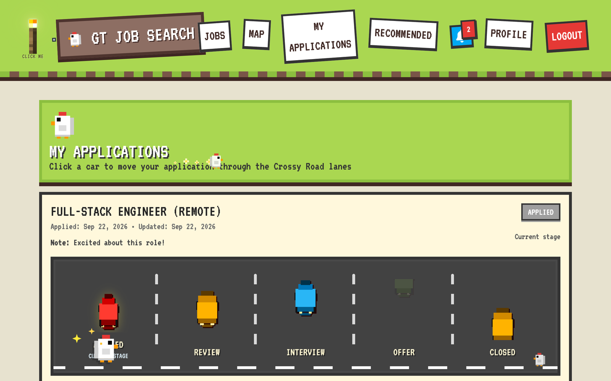
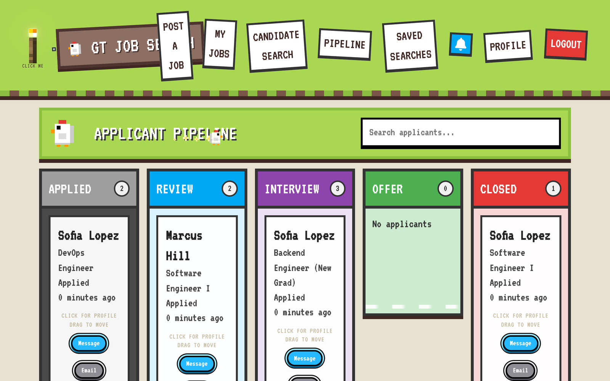
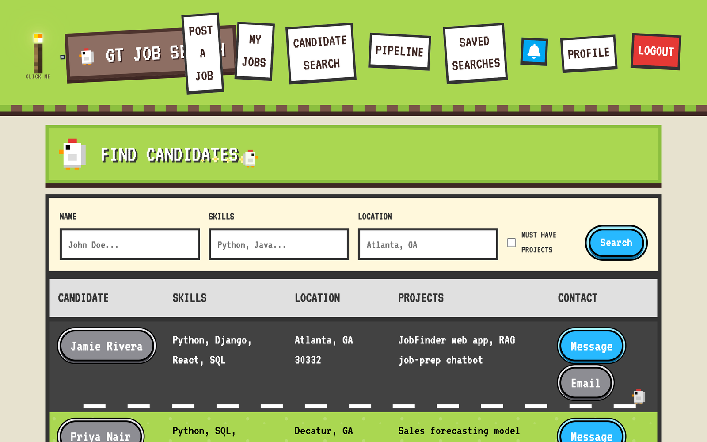
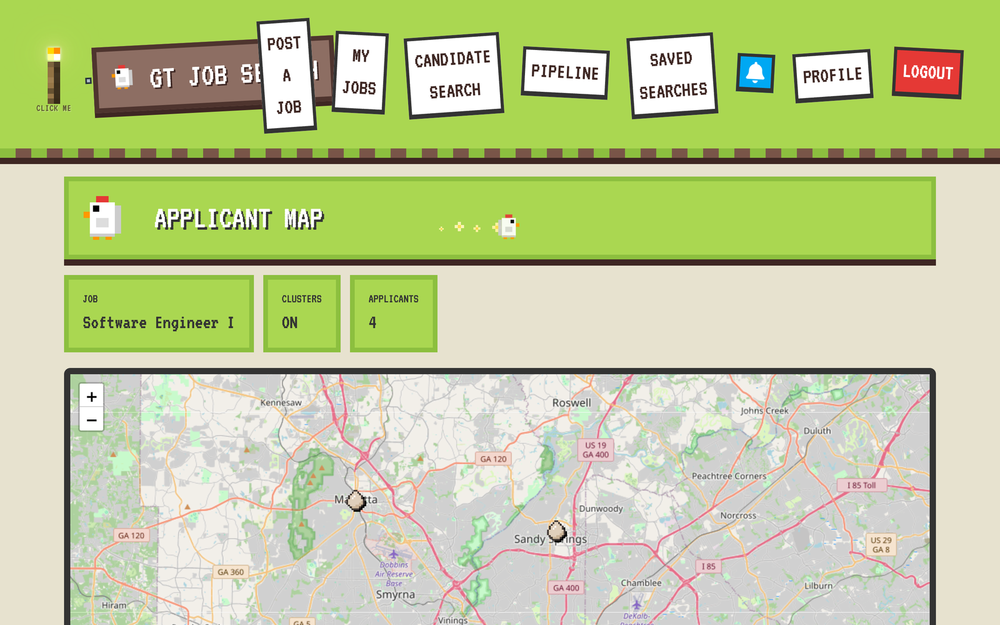
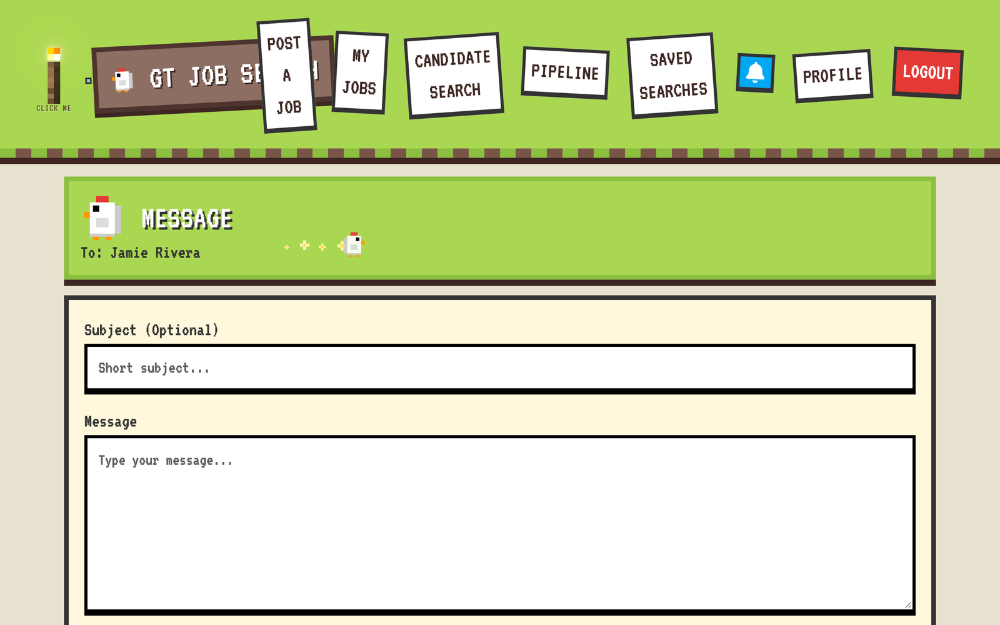

# JobFinder (GT Job Search)

A two-sided job platform that connects early-career job seekers with recruiters. Seekers search jobs on a map, get skill-matched recommendations and track applications. Recruiters post jobs, search candidates, message applicants and move them through a drag-and-drop hiring pipeline. The whole UI is themed after the arcade game *Crossy Road*.

Team project for **CS 2340 (Objects and Design) at Georgia Tech**, Spring 2026.


## Features

**For job seekers**
- Job board with filters for title, skills, location, salary range, remote/on-site and visa sponsorship.
- **Job map:** jobs plotted on an interactive map around your saved home location, filtered by commute radius.
- Recommended jobs ranked by how well each posting's skills match your profile.
- Application tracker: each application "crosses the road" through Applied → Review → Interview → Offer → Closed.
- Profile with privacy controls: hide your whole profile, or individual sections, from recruiters.
- In-app inbox and notifications.

**For recruiters**
- Post and edit jobs, and pick a job's location by searching an address or clicking the map (geocoding and reverse geocoding).
- Kanban-style **applicant pipeline** with drag-and-drop status changes.
- Candidate search by name, skills, location and projects, with saved searches that notify you about new matches.
- **Applicant map:** a clustered map of where a job's applicants live.
- **Messaging:** contact candidates in-app or by email.

## My contributions

- **Location and map features:**
  - geocoding of job and seeker addresses through OpenStreetMap Nominatim (`geopy`, rate-limited)
  - lat/long and structured address fields on jobs and profiles, with migrations
  - a job seeker's saved home location and preferred commute radius
  - the job map page, with radius filtering and custom map markers
- **Recruiter–candidate messaging, end to end:**
  - `Message` model supporting in-app and email delivery, with email status tracking (logged, sent or failed)
  - compose, inbox and sent views, reachable from candidate search and the pipeline
  - the messaging UI pages (compose message, compose email, inbox, sent)
- **Project structure:** set up the `applications` app, per-app template folders and static/media layout. Also wrote the initial README, requirements and `.gitignore`.

## Screenshots

| Job board | Job map (seeker) |
|---|---|
|  |  |
| **Recommended jobs** | **Application tracker** |
|  |  |
| **Recruiter pipeline** | **Candidate search** |
|  |  |
| **Applicant map (recruiter)** | **Messaging** |
|  |  |

## Architecture

```
job_search/     project settings and root URLs
users/          custom User (job seeker / recruiter roles), profiles, privacy settings, auth
jobs/           JobPosting model, search, job map and JSON API, recommendations, geocoding, recruiter tools
applications/   Application pipeline, saved searches, notifications, messaging
templates/      shared base layout (Crossy Road theme)
```

- **Roles:** one custom `User` model with `is_job_seeker` / `is_recruiter` flags, and a separate profile model for each role.
- **Maps:** Leaflet with OpenStreetMap tiles on the frontend. JSON endpoints (`/jobs/map-data/`, `/jobs/recruiter/jobs/<id>/applicant-map-data/`) serve coordinates, and privacy settings are respected server-side.
- **Geocoding:** Nominatim via `geopy`, wrapped in a rate limiter. It runs only when coordinates are missing (remote jobs skip it), and the result is stored on the model.
- **Email:** Django's email framework. The console backend is used in development, so emails print to the terminal.

## Run it locally

```bash
git clone https://github.com/fenais/job-finder.git
cd job-finder
python -m venv .venv && source .venv/bin/activate   # Windows: .venv\Scripts\activate
pip install -r requirements.txt
python manage.py migrate
python manage.py seed_demo      # sample jobs, seekers, recruiters and applications
python manage.py runserver
```

Open http://127.0.0.1:8000. Demo accounts (password `demo12345`):

| Role | Username |
|---|---|
| Job seeker | `seeker` |
| Recruiter | `recruiter` |

## Team

Built with [@nahua3730](https://github.com/nahua3730), [@Ahelwa6](https://github.com/Ahelwa6), [@natalieseng](https://github.com/natalieseng) and [@Janaalzahid](https://github.com/Janaalzahid). The full commit history, including every feature branch, is preserved in this repo. The original team repo is [nahua3730/JobFinder](https://github.com/nahua3730/JobFinder).
